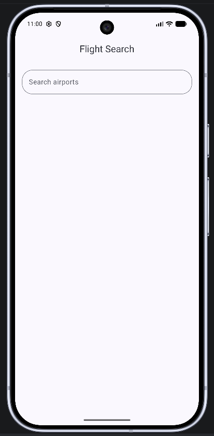
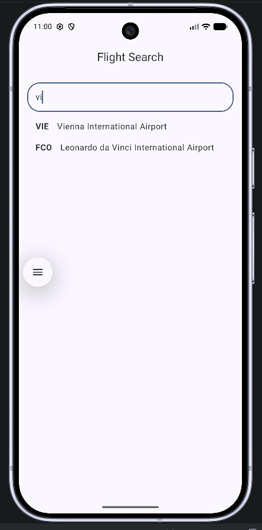
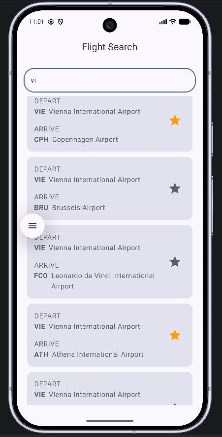
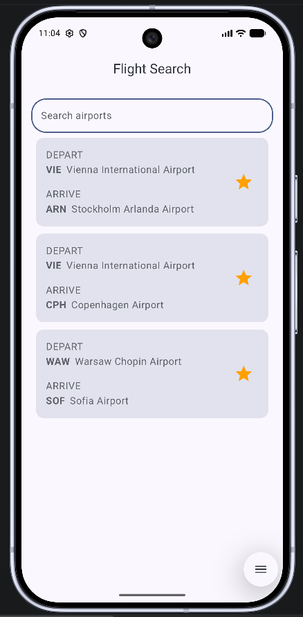

# Flight Search

Flight Search is a small Android app built with Jetpack Compose. It lets users search airports, choose a departure airport, browse possible destination flights, and save favorite routes for quick access later.

This project was built as part of the Android Basics with Compose flight search exercise, with a focus on local persistence, reactive UI state, and a simple repository-based data layer.

## Screenshots

| Start screen | Airport search |
| --- | --- |
|  |  |

| Flight results | Saved favorites |
| --- | --- |
|  |  |

## Features

- Search airports by IATA code or airport name.
- Select a departure airport and view possible destination routes.
- Add and remove favorite flights.
- Favorites are stored locally with Room.
- The latest search query is stored with Preferences DataStore.
- Favorite stars update immediately in the flight results list.
- Favorite list changes use lazy-list item animation for smoother removals.
- UI is built entirely with Jetpack Compose and Material 3.

## Tech Stack

- Kotlin
- Jetpack Compose
- Material 3
- Room
- Preferences DataStore
- Kotlin Coroutines and Flow
- Android Architecture Components ViewModel

## Project Structure

```text
app/src/main/java/com/example/flightsearch
├── data
│   ├── Airport.kt
│   ├── Favorite.kt
│   ├── AirportDAO.kt
│   ├── FavoriteDAO.kt
│   ├── FlightsDatabase.kt
│   ├── OfflineAirportRepository.kt
│   ├── OfflineFavoritesRepository.kt
│   └── local/UserPreferencesRepository.kt
├── ui
│   ├── flight/SearchViewModel.kt
│   ├── screens
│   └── theme
├── FlightsApp.kt
├── FlightsApplication.kt
└── MainActivity.kt
```

The app uses a prepopulated SQLite database asset for airport data:

```text
app/src/main/assets/database/flight_search.db
```

Room manages the local database, while repository classes keep the UI layer separate from the storage implementation.

## Persistence

The app stores two different kinds of local data:

- Favorite routes are stored in the Room `favorite` table.
- The current search query is stored in Preferences DataStore.

This means saved favorites and the last query can survive app restarts, as long as the app data is not cleared or the app is not uninstalled.

## What I Practiced

- Building Compose screens from reactive state.
- Combining Room `Flow` results with ViewModel state.
- Using a repository layer for data access.
- Persisting lightweight user preferences with DataStore.
- Updating UI state immediately after user actions.
- Adding small UI animations to make list changes feel smoother.

